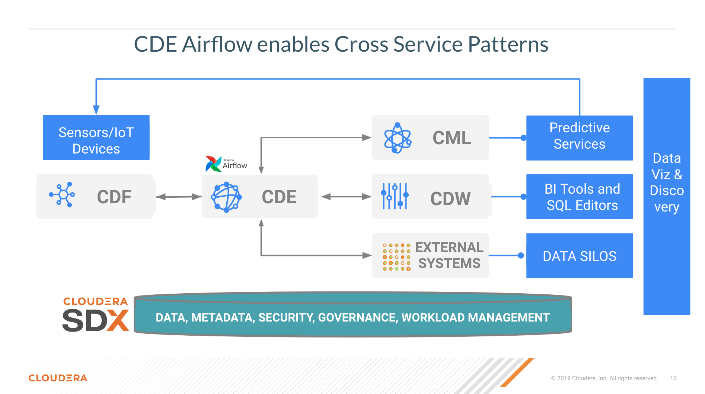

# CDE 1.19 New Features

## Objective

CDE 1.19 has been introduced in May 2023 with the following enhancements and new features:

* Two Tiers of Virtual Clusters: Core and All-Purpose. Core clusters are dedicated to batch jobs. All-Purpose clusters include Interactive Sessions.
* Interactive sessions: introducing Spark Shell capabilities directly within the CDE Virtual Cluster.
* Spark 3.3 Support.  Now CDE supports 3 versions of Spark -- 2.4, 3.2, and 3.3. 3.2 will also serve as the LTS so customer can depend on it like they do on-premise.
* Support for Hong Kong & Jakarta workload regions.
* Airflow performance is now 2x faster from a combination of upgrade & continued optimizations.
* Support for File Resources with Airflow CDE Jobs: you can now mount extra files to Airflow jobs. This will be extended in the next release to support python packages.
* CDE CLI profiles: ability to set up multiple virtual clusters and keys and easily switch between them using the CLI.
* Spark-submit migration tooling: use the tool to migrate Datahub Spark jobs to CDE.

To learn more please visit the release notes at [this URL](https://docs.cloudera.com/data-engineering/cloud/release-notes/topics/cde-whats-new-1.19.html)

This repository showcases the following 1.19 capabilities:

* [Interactive Sessions](https://github.com/pdefusco/CDE_1.19_NewFeatures#interactive-sessions)
* [Using CDE Airflow Jobs with File Resources](https://github.com/pdefusco/CDE_1.19_NewFeatures#using-cde-airflow-jobs-with-file-resources)
* [Spark Submit Migration Tool](https://github.com/pdefusco/CDE_1.19_NewFeatures#spark-submit-migration-tool)


## Requirements

You can reproduce these use cases in your CDE Virtual Cluster:

* CDE Service Version 1.19 in Private or Public Cloud (AWS, Azure, OCP and Cloudera ECS ok).
* A CDE Virtual Cluster of type "All-Purpose".
* Basic familiarity with Python, PySpark, Airflow and Docker.


## Project Setup

Clone this git repository to a local folder on your machine. All files and dependencies are included in this project.


## Interactive Sessions

### Using Interactive Sessions in the CDE UI

From the CDE Landing Page open "Sessions" on the left pane and then select the CDE Virtual Cluster where you want to run your CDE Interactive Session.


The session will be in "starting" state for a few moments. When it's ready, launch it and open the Spark Shell by clicking on the "Interact" tab.

Copy and paste the following code snippets in each cell and observe the output (no code changes required).

>**Note**  
>CDE Sessions do not require creating the SparkSession object. The shell has already been launched for you. However, if you need to import any types or functions you do have to import the necessary modules.

Import PySpark:

```
from pyspark.sql.types import Row, StructField, StructType, StringType, IntegerType
```

Create a list of Rows. Infer schema from the first row, create a DataFrame and print the schema:

```
rows = [Row(name="John", age=19), Row(name="Smith", age=23), Row(name="Sarah", age=18)]
some_df = spark.createDataFrame(rows)
some_df.printSchema()
```

Create a list of tuples:

```
tuples = [("John", 19), ("Smith", 23), ("Sarah", 18)]
```

Create a Spark schema with two fields - person_name and person_age

```
schema = StructType([StructField("person_name", StringType(), False),
                    StructField("person_age", IntegerType(), False)])
```

Create a DataFrame by applying the schema to the RDD and print the schema

```
another_df = spark.createDataFrame(tuples, schema)
another_df.printSchema()
```

Iterate through the Spark Dataframe:

```
for each in another_df.collect():
    print(each[0])
```


### Using Interactive Sessions with the CDE CLI

You can interact with the same CDE Session from your local terminal using the ```cde sessions interact``` command.

Open your terminal and enter ```cde session interact --name InteractiveSession```. You will be prompted for your password and then the SparkShell will launch.

Run the same PySpark code into the shell.


Navigate back to the CDE Session and validate that the code has run from the UI.


You can also create a session directly from the CLI. In your local terminal, exit out of your current Spark Shell with "ctrl+D" and then run the following command:

```cde session create --name cde_shell_from_cli --type spark-scala --description launched-from-cli --executor-cores 4 --num-executors 2```.

Notice that you can pass CDE Compute Options such as number of executors and executor-cores when using the command.


## Using CDE Airflow Jobs with File Resources

Until CDE 1.18 File resources allowed you to mount files with CDE Spark Jobs only. CDE 1.19 introduces the ability to leverage File Resources with CDEc Airflow jobs. In practice, this means that you can use an Airflow Operator to parse values from files loaded on CDE File Resources and execute conditional logic in your DAG with them.

Open the ```airflow_dag.py``` file located in the ```cde_jobs``` folder. Familiarize yourself with the code. Notice the following:

* Lines 84-88: an instance of BashOperator is used to read the file from the CDE File Resource. Notice that we save the value as an xcom variable at line 87. Xcoms allow you to temporarily store values so they are accessible by other operators. Also notice that ```my_airflow_file_resource``` is the name of the CDE Resource while ```my_file.conf``` is the name of the File we will upload in it.

```
read_conf = BashOperator(
      task_id="read-resource-file-task",
      bash_command="cat /app/mount/my_airflow_file_resource/my_file.conf",
        do_xcom_push=True
  )
```

* Line 90-96: an instance of the PythonOperator is used to parse the value read from the Airflow Job Dependency file via Xcom. In general you can use a similar approach to transform, process and refine values read from files.

```
def _print_confs(**context):
    return context['ti'].xcom_pull(task_ids='read-resource-file-task')

pythonstep = PythonOperator(
    task_id="print_file_resource_confs",
    python_callable=_print_confs,
)
```

* Lines 98-108: Airflow Task Branching is used to make a decision based on the value read from the File Resource. In this example we use two instance of EmptyOperator (lines 110 and 11) but you can more generally use this approach to implement complex logic in your DAG.

```
@task.branch(task_id="branch_task")
def branch_func(**context):
    airflow_file_resource_value = int(context['ti'].xcom_pull(task_ids="read-resource-file-task"))
    if airflow_file_resource_value >= 5:
        return "continue_task"
    elif airflow_file_resource_value >= 2 and airflow_file_resource_value < 5:
        return "stop_task"
    else:
        return None

branch_op = branch_func()

continue_op = EmptyOperator(task_id="continue_task")
stop_op = EmptyOperator(task_id="stop_task")
```

#### Steps to Reproduce the Example in your CDE Cluster

Using the CDE Jobs UI create a CDE Spark Job with name ```spark-sql``` with the ```pyspark_sql.py``` script without running it.

Open your local terminal and run the following CDE CLI commands.

>**⚠ Warning**  
>A CDE 1.19 Virtual Cluster is required. If you already had the CLI installed you will have to reinstall it. The fastest way to check is by running ```cde --version``` from your terminal. For instructions on installing the CLI please visit the [documentation](https://docs.cloudera.com/data-engineering/cloud/cli-access/topics/cde-cli.html)

Create a File Resource for your Airflow Job:

```
cde resource create --name my_pipeline_resource
```

Upload the Airflow DAG script to the CDE File Resource:

```
cde resource upload --name my_pipeline_resource --local-path airflow_dag.py
```

Create a File Resource for your Airflow Dependency File:

```
cde resource create --name my_airflow_file_resource
```

Upload the Airflow Dependency File to the File Resource:

```
cde resource upload --name my_airflow_file_resource --local-path my_file.conf
```

Run the CDE Airflow Job:

```
cde job create --name my_pipeline --type airflow --dag-file airflow_dag.py --mount-1-resource my_pipeline_resource --airflow-file-mount-1-resource my_airflow_file_resource
```

Navigate back to the CDE Job Runs page and validate outputs in the Logs tabs.


Open the Airflow UI and validate job execution.


You can choose from a variety of Airflow monitoring options. For example the Graph tab provides a way to validate which branch was chosen by the Airflow DAG.


## Spark Submit Migration Tool

The CDE CLI provides a similar although not identical way of running "spark-submits" in CDE. However, adapting many spark-submit command to CDE might become an obstacle. The CDE Engineering team created a Spark Migration tool to facilitate the conversion of a spark-submit to a cde spark-submit.

#### Step By Step Instructions

>**⚠ Warning**  
>This tutorial utilizes Docker to streamline the installation process of the Spark Submit Migration tool. If you don't have Docker installed on your machine you will have to install it manually by following [this tutorial by Vish Rajagopalan](https://github.com/SuperEllipse/cde-spark-submit-migration) instead.

Navigate to the CDP Management Console and download your user credentials file. The credentials file includes a CDP Access Key ID and a CDP Private Key.


Next, navigate to the CDE Virtual Cluster Details and copy the JOBS_API_URL.


Launch the example Docker container.

```
docker run -it pauldefusco/cde_spark_submit_migration_tool:latest
```

You are now inside the running container. Next, activate the Spark Submit Migration tool by running the following shell command.

```
cde-env.sh activate -p vc-1
```

Navigate to the .cde folder and place the CDP Access Key ID and Private Key you downloaded earlier in the respective fields.

Next, open the config.yaml file located in the same folder. Replace the cdp console value at line 3 with the CDP Console URL (e.g. `https://console.us-west-1.cdp.cloudera.com/`).
Then, enter your JOBS_API_URL in the "vcluster-endpoint" field at line 8.

Finally, run the following spark-submit. This is a sample submit taken from a legacy CDH cluster.

```
spark-submit \
--master yarn \
--deploy-mode cluster \
--num-executors 2 \
--executor-cores 1 \
--executor-memory 2G \
--driver-memory 1G \
--driver-cores 1 \
--queue default \
06-pyspark-sql.py
```

Shortly you should get output in your terminal including a Job Run ID confirming successful job submission to CDE. In the screenshot example below the Job Run ID is 9.


Navigate to your CDE Virtual Cluster Job Runs page and validate the job is running or has run successfully.


>**⚠ Warning**  
>If you are unable to run the spark-submit you may have to remove the tls setting from config.yaml. In other words, completely erase line 4 from your config file under the .cde folder.


## Conclusions & Next Steps

CDE is the Cloudera Data Engineering Service, a containerized managed service for Spark and Airflow. Each CDE virtual cluster includes an embedded instance of Apache Airflow.

With Airflow based pipelines users can now specify their data pipeline using a simple python configuration file.

A basic CDE Airflow DAG can be composed of a mix of hive and spark operators that automatically run jobs on CDP Data Warehouse (CDW) and CDE, respectively; with the underlying security and governance provided by SDX.

However, thanks to the flexibility of Airflow, CDE can also empower users with the ability to integrate with other CDP Data Services and 3rd party systems.
For example, you can combine the operators we have seen above to create complex pipeleines across multiple domains such as Datawarehousing, Machine Learning, and much more.



If you are exploring CDE you may find the following tutorials relevant:

* [Using CDE Airflow](https://github.com/pdefusco/Using_CDE_Airflow): an deep dive into CDE Airflow Capabilities along with answers to FAQ's and Cloudera-recommended best practices.

* [Spark 3 & Iceberg](https://github.com/pdefusco/Spark3_Iceberg_CML): a quick intro of Time Travel Capabilities with Spark 3

* [Simple Intro to the CDE CLI](https://github.com/pdefusco/CDE_CLI_Simple): A simple introduction to the CDE CLI for the

* [CDE CLI Demo](https://github.com/pdefusco/CDE_CLI_demo): A more advanced CDE CLI reference with additional details for the CDE user who wants to move beyond the basics shown here.

* [GitLab2CDE](https://github.com/pdefusco/Gitlab2CDE): a CI/CD pipeline to orchestrate Cross Cluster Workflows - Hybrid/Multicloud Data Engineering

* [CML2CDE](https://github.com/pdefusco/CML2CDE): a CI/CD Pipeline to deploy Spark ETL at Scale with Python and the CDE API

* [Postman2CDE](https://github.com/pdefusco/Oozie2CDE_Migration): using the Postman API to bootstrap CDE Services

For more information on the Cloudera Data Platform and its form factors please visit [this site](https://docs.cloudera.com/).

For more information on migrating Spark jobs to CDE, please reference [this guide](https://docs.cloudera.com/cdp-private-cloud-upgrade/latest/cdppvc-data-migration-spark/topics/cdp-migration-spark-cdp-cde.html).

If you have any questions about CML or would like to see a demo, please reach out to your Cloudera Account Team or send a message [through this portal](https://www.cloudera.com/contact-sales.html) and we will be in contact with you soon.
